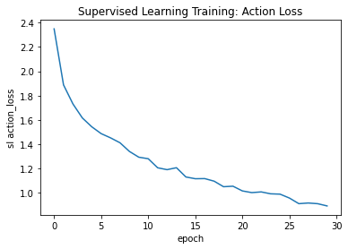
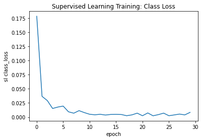
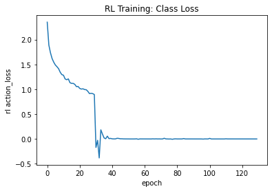

## Authors
* **Sanjeev Kumar Singh**
* **Ankur Kunder**


Results on vot2013/bicycle:


<table class="tg">
  <tr>
    <th class="tg-0pky">Models</th>
    <th class="tg-0pky">FPS</th>
  </tr>
  <tr>
    <td class="tg-0lax">ADNet</td>
    <td class="tg-0lax">2.90</td>
  </tr>
  <tr>
    <td class="tg-0lax">ADNet-Fast</td>
    <td class="tg-0lax">15.00</td>
  </tr>
  <tr>
    <td class="tg-0lax">Ours</td>
    <td class="tg-0lax">9.65</td>
  </tr>
</table>

**Python version**: This code is in Python3.6

**Package Requirements**: tensorflow==1.14.0, OpenCV==3.4.2, pyyaml, hdf5storage, h5py

## Graphs
<h3 align="center">
  
</h3>

<h3 align="center">
  
</h3>

<h3 align="center">
  
</h3>

* The plots shown are the obsrvations collected on single training video

# Our Model
Implementation of 'Action-Decision Networks for Visual Tracking with Deep Reinforcement Learning(CVPR 2017)'

| GIF      | Description                    |
|:---------|:-------------------------------|
|  | vot2013 Dataset bicycle |
* Green : Ground Truth, Blue : Ours implemented model


### Data Preperation: 

#### Step 1
Download the Visual Object Tracking Dataset from [website](https://www.votchallenge.net/). We have used the data for 2013, 2014 and 2015. More data always helps.
### Step 2
Put the inside folder `train_data` as `vot2013`, `vot2014` and `vot2014`. This folder should have folder video wise and inside each folder. extract frames in `img` folder.


## Model Training
```
python runner.py -debug <bool denoting debug on 1 video> -mode <train|test> -rl <bool denoting if RL is on> -model_path <model-path> -vid_path <video-path>
```
* Loss will be logged at `model_path/loss.log`
* You can download our pre-trained model at [this](https://drive.google.com/file/d/1d_oDT5VHw-8UmFva1dsxCFx83OYuFk2A/view?usp=sharing) link.

## Acknowledgements
Base Code is take from [here](https://github.com/ildoonet/tf-adnet-tracking)

